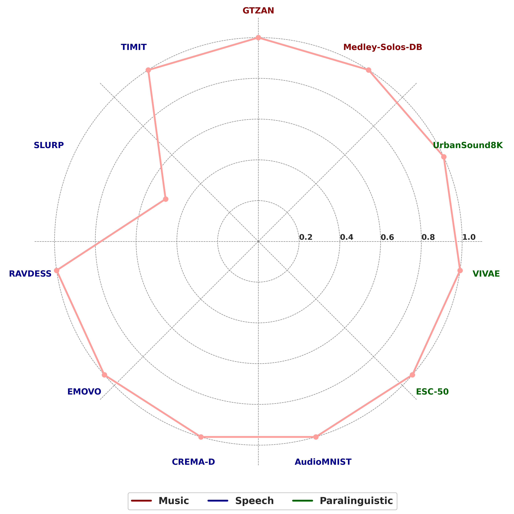

# 🎧 Neural Audio Codecs for Audio Classification

## Abstract

We propose a novel framework for **audio classification using large language models (LLMs)** in conjunction with **neural audio codecs**. Instead of processing raw waveforms or spectrograms, our pipeline encodes audio using a **self-supervised neural audio codec (XCodec2)** and feeds the resulting semantic token stream into a **pre-trained multilingual language model (Llasa-1B)**.

This approach treats audio classification as a **sequence-to-sequence instruction-following task**, where class labels are embedded into natural language prompts. It leverages the multimodal token space of Llasa-1B, enabling classification across diverse domains without architectural changes.

We benchmark our system on the **ARCH benchmark**, which comprises a wide variety of datasets across **sound event**, **music**, and **speech** classification tasks.

---

## 🔧 Components

- **Audio Codec**: `XCodec2` (neural codec pretrained on speech/audio)
- **LLM Backbone**: `Llasa-1B-Multilingual`
- **Prompt Style**:  `<|TEXT_UNDERSTANDING_START|> Classify the audio in the following segment. <|TEXT_UNDERSTANDING_END|> → LABEL`

---

## 🎯 Task Types

- Single-label classification (e.g., digit recognition, emotion detection)
- Multi-label classification (e.g., instrument tagging)
- Categories: **Sound Events**, **Music**, **Speech**

---

## 📚 Benchmark Datasets

| Dataset           | Type         | Domain         | Integrated |
|------------------|--------------|----------------|------------|
| ESC-50           | Single-label | Sound events   | ✅         |
| UrbanSound8K     | Single-label | Sound events   | ✅         |
| VIVAE            | Single-label | Sound events   | ✅         |
| CREMA-D          | Single-label | Paralinguistic | ✅         |
| RAVDESS          | Single-label | Paralinguistic | ✅         |
| GTZAN            | Single-label | Paralinguistic | ✅         |
| Medley-Solos-DB  | Single-label | Music          | ✅         |
| AudioMNIST       | Single-label | Speech         | ✅         |
| EMOVO            | Single-label | Speech         | ✅         |
| SLURP            | Single-label | Speech         | ✅         |
| TIMIT            | Single-label | Speech         | ✅         |
| MSDB             | Single-label | Music          | ✅         |

---

## 📊 Performance Overview

  

---

## 🚧 TODO

- [ ] Add VCTK and MTG-Jamendo datasets
- [ ] Benchmark against waveform and spectrogram-based LLMs
- [ ] Add support for Audio Question Answering (Clotho-AQA)
